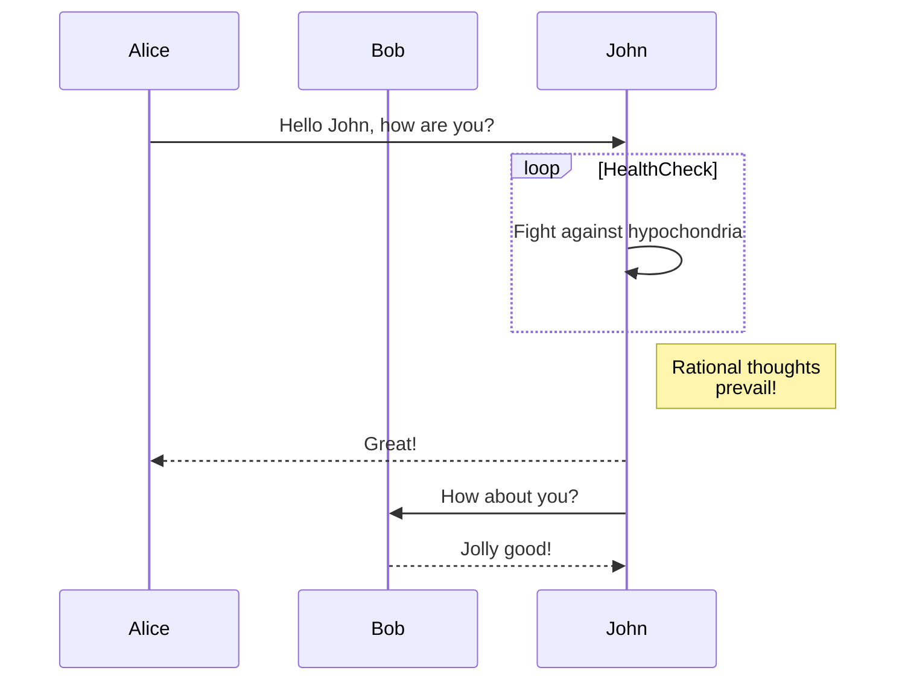

#개인 숙제

관계사별 M365 구축/설정현황 체크리스트
요구사항과 I.A 설계 (항목별 체크리스트 작성)

---

```mermaid
sequenceDiagram
    participant Alice
    participant Bob
    Alice->>John: Hello John, how are you?
    loop HealthCheck
        John->>John: Fight against hypochondria
    end
    Note right of John: Rational thoughts <br/>prevail!
    John-->>Alice: Great!
    John->>Bob: How about you?
    Bob-->>John: Jolly good!
```    
